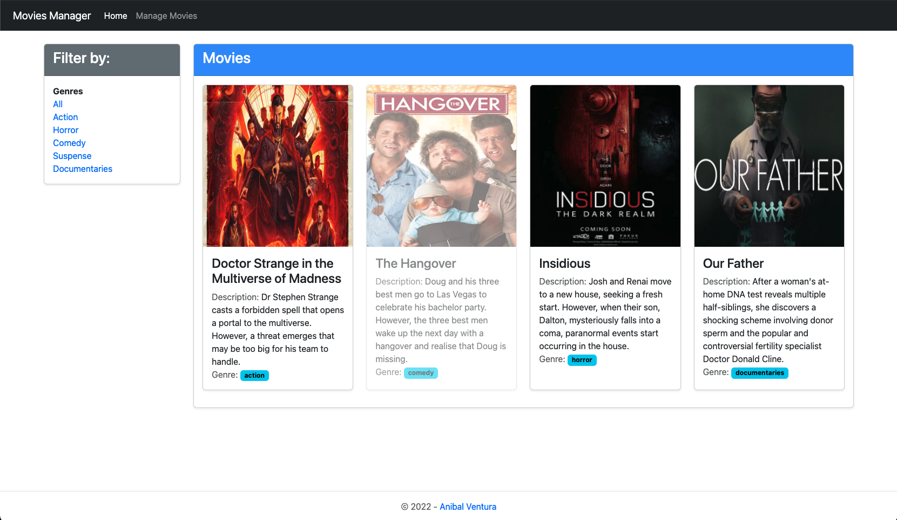
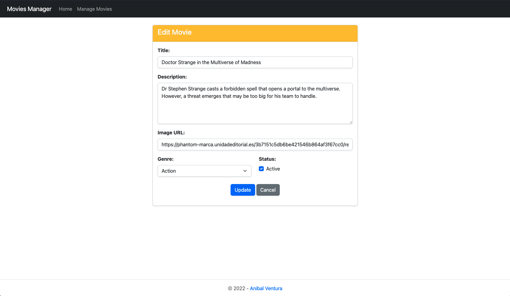

# Movie Manager

[](https://nodejs.org/en/)
[](https://expressjs.com/)
[](https://handlebarsjs.com/)
[](LICENSE.md)

<p align="center">
  
  
</p>


Simple movie manager with CRUD operations and MVC architecture.

## Features

- Filters by gender.
- Data persistance with a JSON file.
- CRUD operations on a movie.
- Form validation.

## Technologies

- HTML / Javascript / Bootstrap
- NodeJS / ExpressJS

## Dependencies

- [express ^4.17.1](https://www.npmjs.com/package/express)
- [express-handlebars ^5.3.2](https://www.npmjs.com/package/express-handlebars)

### Dev Dependencies

- [nodemon ^2.0.12](https://www.npmjs.com/package/nodemon)

## Build

1. Download/clone project and run in terminal `npm install`
2. Run in terminal `npm start`

## License

```xml
MIT License

Copyright (c) 2022 Anibal Ventura
```
